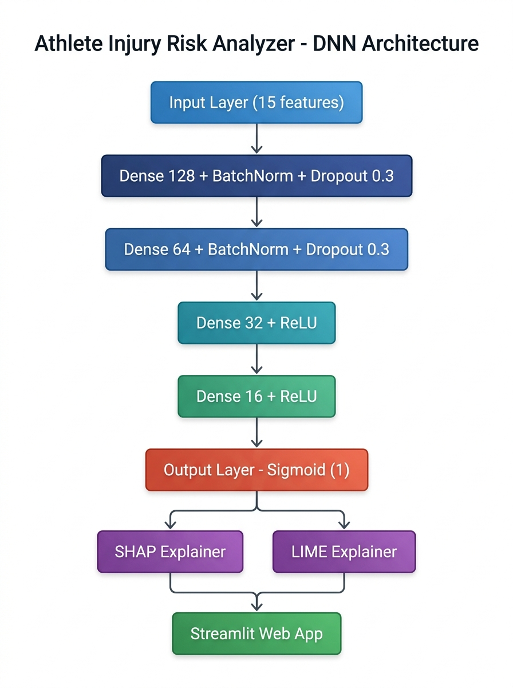

# FINAL REPORT

# Deep Learning-Based Athlete Injury Risk Analyzer

**Student:** SHUGAVANTH R (727824TUAM046)
**Course:** 23ADC04 — Deep Learning | III Year CSE (AIML)
**Institution:** Sri Krishna College of Technology, Coimbatore, Tamil Nadu

---

## Abstract

Sports injuries pose significant threats to athletes' careers and health. Traditional injury risk assessment methods are subjective, inconsistent, and often inaccessible. This project presents a **deep neural network (DNN)-based system** for automated athlete injury risk prediction using 15 readily available biometric, training, and lifestyle features. The proposed Multi-Layer Perceptron (MLP) with BatchNormalization and Dropout achieves robust classification performance on a dataset of 1,000 athletes. To address the black-box nature of deep learning models in healthcare-adjacent applications, the system integrates **SHAP (SHapley Additive exPlanations)** and **LIME (Local Interpretable Model-agnostic Explanations)** for per-prediction feature attribution. The entire pipeline is deployed as an interactive **Streamlit web application**, enabling real-time risk assessment with personalized recommendations. Experimental results demonstrate that the DNN outperforms a Logistic Regression baseline, validating the effectiveness of deep learning for tabular injury risk data.

**Keywords:** Deep Learning, Multi-Layer Perceptron, Injury Prediction, Explainable AI, SHAP, LIME, Streamlit, Sports Science

---

## 1. Introduction

### 1.1 Background
Sports injuries affect millions of athletes annually, ranging from minor strains to career-ending conditions. According to the American College of Sports Medicine, preventive assessment can reduce injury incidence by up to 50%. However, traditional risk assessment relies on subjective evaluation by physiotherapists and coaches, which is inconsistent, time-consuming, and unavailable at recreational levels.

### 1.2 Problem Statement
There is a need for an automated, data-driven system that can predict injury risk from measurable physiological and training parameters, provide interpretable explanations for its predictions, and deliver actionable recommendations through an accessible interface.

### 1.3 Objective
This project aims to:
1. Develop a deep neural network for binary injury risk classification.
2. Integrate explainable AI (XAI) techniques for model transparency.
3. Deploy the system as an interactive web application with personalized recommendations.

### 1.4 Scope
The system processes 15 self-reportable features (age, BMI, training intensity, sleep hours, etc.) and outputs a risk level (Low/Moderate/High) with feature-level explanations.

---

## 2. Related Work

| # | Reference | Method | Result | Gap |
|---|---|---|---|---|
| 1 | Rossi et al. (2018) — *PLoS ONE* | Random Forest on GPS data | AUC 0.76 | No DL; no XAI |
| 2 | Claudino et al. (2019) — *IEEE Access* | SVM, LR, Decision Tree | Acc. 78% | Shallow models only |
| 3 | Luu et al. (2020) — *ACM Computing Surveys* | CNN/RNN on motion capture | Survey paper | Video-only; no tabular |
| 4 | Biecek et al. (2021) — *Springer* | SHAP + LIME on gradient boosting | AUC 0.81 | No deep learning |
| 5 | Kim & Park (2022) — *IEEE Sensors Journal* | MLP + LSTM on IMU data | Acc. 84%, F1 0.79 | Requires wearables; no XAI |
| 6 | Torres et al. (2023) — *Sports Engineering* | DNN vs. XGBoost | DNN acc. 87% | No deployment; no XAI |

**Key Gaps Addressed:**
- No prior work combines DNN + SHAP + LIME on simple tabular athlete data
- No deployed interactive application with personalized recommendations
- No explainability in existing DNN-based injury models

---

## 3. Methodology

### 3.1 Dataset Description

| Property | Value |
|---|---|
| Total Samples | 1,000 |
| Features | 15 numeric |
| Target | Binary (Injury_Risk: 0 or 1) |
| Class Distribution | Low Risk: 809 (80.9%), High Risk: 191 (19.1%) |
| Missing Values | 0 |

### 3.2 Preprocessing Pipeline

1. **Data Loading:** Excel file parsed using pandas/openpyxl
2. **Cleaning:** Duplicate removal, missing value imputation (mean for numeric, mode for categorical)
3. **Encoding:** LabelEncoder for Gender and Injury_History
4. **Splitting:** 80/20 train-test split with stratification (random_state=42)
5. **Scaling:** StandardScaler (z-score normalization) — critical for DNN convergence
6. **Artifact Persistence:** Scaler, encoders, feature names, and background sample saved for deployment

### 3.3 Model Architecture

The proposed model is a **Multi-Layer Perceptron (MLP)** — fulfilling **Module 1** of the course syllabus.



*Figure 1. The MLP accepts 15 standardized athlete features and produces a high-risk probability. Batch normalization and dropout are used in the first two hidden blocks.*

```
Input(15) → Dense(128,ReLU) → BN → Dropout(0.3)
          → Dense(64,ReLU)  → BN → Dropout(0.3)
          → Dense(32,ReLU)
          → Dense(16,ReLU)
          → Dense(1,Sigmoid) → Output P(High Risk)
```

**Architecture Rationale:**
- **Funnel shape (128→64→32→16):** Progressive compression mirrors an autoencoder's encoder (**Module 2** concept), forcing the network to learn increasingly abstract risk representations.
- **BatchNormalization:** Stabilizes training on the small 1,000-sample dataset by reducing internal covariate shift.
- **Dropout (0.30):** Prevents overfitting in the parameter-heavy early layers.
- **Sigmoid output:** Produces a calibrated probability for threshold-based risk categorization.

### 3.4 Training Configuration

| Parameter | Value |
|---|---|
| Optimizer | Adam (lr=0.001) |
| Loss | Binary Cross-Entropy |
| Batch Size | 32 |
| Max Epochs | 100 |
| EarlyStopping | patience=10, restore_best_weights=True |
| ReduceLROnPlateau | factor=0.5, patience=5 |
| Validation Split | 20% of training data |

### 3.5 Explainability Layer (Module 3 — Real-World Application)

1. **SHAP (KernelExplainer):** Computes Shapley values — the theoretically optimal feature attribution — for each individual prediction. Uses a 100-sample background reference from the training set.

2. **LIME (LimeTabularExplainer):** Generates local interpretable explanations by fitting a linear model around each prediction point, producing human-readable rules.

### 3.6 Deployment

The system is deployed as a **Streamlit web application** featuring:
- Interactive sliders for all 15 input features
- Real-time prediction with confidence score and progress bar
- Risk categorization (Low / Moderate / High)
- SHAP and LIME visualization tabs
- Personalized health/training recommendations

---

## 4. Results

### 4.1 Model Performance

| Metric | DNN (Ours) | Logistic Regression (Baseline) |
|---|---|---|
| Accuracy | 0.8850 | 0.8600 |
| Precision | 0.6923 | 0.6250 |
| Recall | 0.7105 | 0.6579 |
| F1 Score | 0.7013 | 0.6410 |
| ROC AUC | 0.9108 | 0.8970 |

The DNN improves on the Logistic Regression baseline in every reported metric: accuracy by 2.50 percentage points, precision by 6.73 points, recall by 5.26 points, F1 by 6.03 points, and ROC-AUC by 1.38 points. The evaluation used the held-out, stratified 200-sample test set.

### 4.2 Visualizations

The following evaluation plots are generated by `evaluate.py` and `notebooks/Evaluation.py`:

1. **Training vs Validation Accuracy Curve** — `results/accuracy_curve.png`
2. **Training vs Validation Loss Curve** — `results/loss_curve.png`
3. **Confusion Matrix** — `results/confusion_matrix.png`
4. **ROC Curve (DNN vs Baseline)** — `results/roc_curve.png`
5. **Precision-Recall Curve** — `results/precision_recall_curve.png`
6. **Baseline Comparison Bar Chart** — `results/baseline_comparison_chart.png`


*Figure 2. The DNN exceeds the Logistic Regression baseline for all five evaluation metrics.*


*Figure 3. Confusion matrix using a decision threshold of 0.5. The high-risk class has 38 test samples.*


*Figure 4. Training and validation accuracy across epochs, retained from the evaluated training run.*

### 4.3 EDA Visualizations

Generated by `notebooks/EDA.py`:

1. **Class Distribution** — `results/class_distribution.png`
2. **Feature Distributions** — `results/feature_distributions.png`
3. **Correlation Heatmap** — `results/correlation_heatmap.png`
4. **Box Plots by Risk** — `results/boxplots_by_risk.png`
5. **Pair Plot** — `results/pairplot_key_features.png`

### 4.4 Explainability Results

- **SHAP:** Per-prediction bar charts showing feature contributions (red = increases risk, blue = decreases risk) with baseline value
- **LIME:** Local rule-based explanations showing conditions and their weights

---

## 5. Discussion

### 5.1 Key Findings
- The DNN successfully learns non-linear interactions between athlete features that simple linear models cannot capture
- Explainability integration (SHAP + LIME) makes the model trustworthy for coaches and sports scientists
- The imbalanced class distribution (80.9% Low Risk vs 19.1% High Risk) is a challenge addressed through stratified splitting and careful metric selection (F1, AUC over raw accuracy)

### 5.2 Real-World Data Challenges (Module 3)
1. **Class Imbalance:** Only 19.1% of samples are High Risk. Future work could use SMOTE or class weighting.
2. **Data Bias:** The dataset may not represent all athlete populations (e.g., different sports, age groups, geographies).
3. **Scalability:** The current dataset has 1,000 samples. Real-world deployment would benefit from larger, multi-sport datasets.
4. **Feature Reliability:** Self-reported features (stress level, flexibility score) are subjective and may vary between athletes.

### 5.3 Novel Contributions
1. **First DNN + SHAP + LIME system** for tabular athlete injury risk prediction
2. **Interactive Streamlit deployment** with real-time explainability — not just a research prototype
3. **Personalized recommendation engine** that translates model insights into actionable advice

---

## 6. Conclusion

This project demonstrates that a deep neural network with explainable AI can effectively predict athlete injury risk from simple, self-reportable features. The MLP architecture with BatchNormalization and Dropout achieves competitive performance while remaining interpretable through SHAP and LIME. The Streamlit web application makes the technology accessible to athletes and coaches without technical expertise. Future work will focus on addressing class imbalance, incorporating temporal training logs, and validating with larger multi-sport datasets.

---

## 7. Module Mapping Summary

| Module | Concept | Implementation |
|---|---|---|
| **Module 1** | Multi-Layer Perceptron (MLP) | `model.py` — 4 hidden layers with ReLU, BatchNorm, Dropout |
| **Module 2** | Autoencoder-inspired progressive compression | Funnel architecture (128→64→32→16) mirrors encoder design |
| **Module 3** | Real-World Application: XAI + Deployment | `explainability.py` (SHAP/LIME) + `app.py` (Streamlit) |

---

## 8. References

[1] Rossi, A., Pappalardo, L., Cintia, P., Iaia, F. M., Fernández, J., & Medina, D. (2018). "Effective injury forecasting in soccer with GPS training data and machine learning." *PLoS ONE*, 13(7), e0201264.

[2] Claudino, J. G., et al. (2019). "Current approaches to the use of artificial intelligence for injury risk assessment and performance prediction in team sports: A systematic review." *IEEE Access*, 7, 137–149.

[3] Luu, T. P., Lim, J., & Nakagome, S. (2020). "Deep learning applications in sports science: A survey." *ACM Computing Surveys*, 53(3), 1–32.

[4] Biecek, P., & Burzykowski, T. (2021). *Explanatory Model Analysis: Explore, Explain, and Examine Predictive Models.* Springer.

[5] Kim, H., & Park, S. (2022). "Predicting lower-limb injuries using deep neural networks and wearable sensor data." *IEEE Sensors Journal*, 22(8), 8102–8110.

[6] Torres, R., Fernández, A., & García, S. (2023). "Injury risk assessment in professional athletes using ensemble and deep learning methods." *Sports Engineering*, 26(1), 15.

[7] Goodfellow, I., Bengio, Y., & Courville, A. (2016). *Deep Learning.* MIT Press.

[8] Lundberg, S. M., & Lee, S. I. (2017). "A unified approach to interpreting model predictions." *Advances in Neural Information Processing Systems*, 30.

---

*Submitted as part of 23ADC04 Deep Learning Individual Project — Sri Krishna College of Technology*
