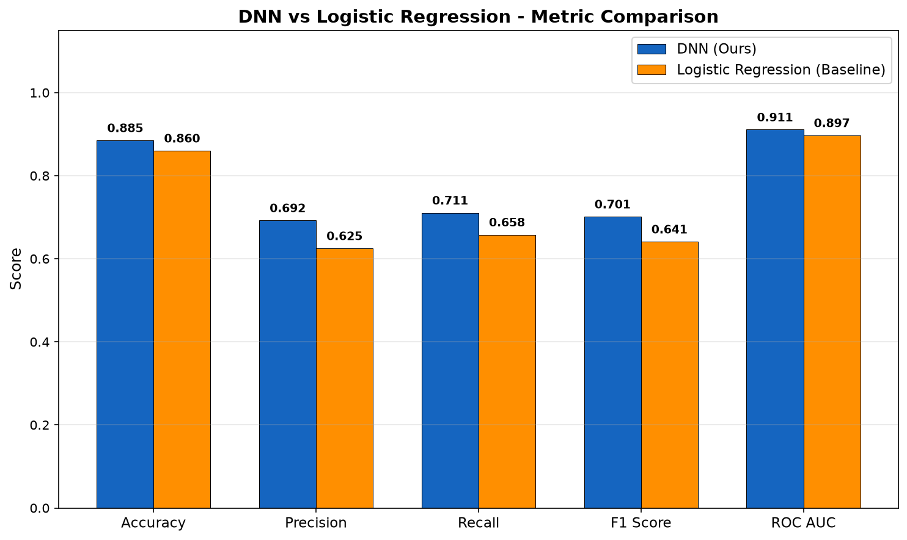
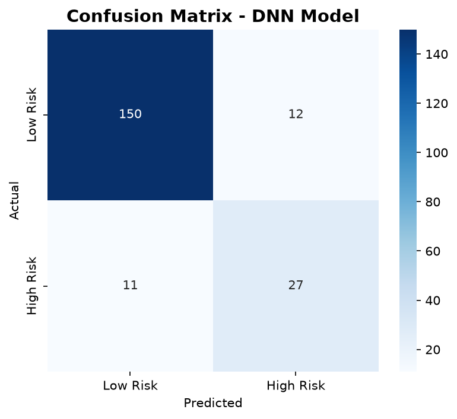
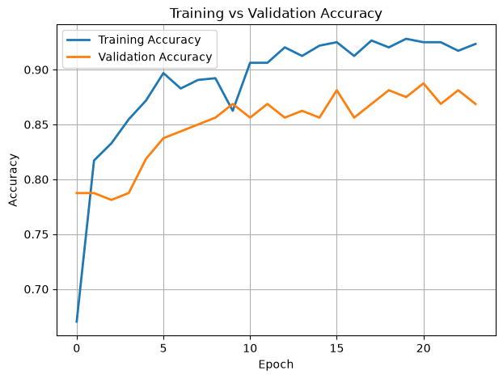
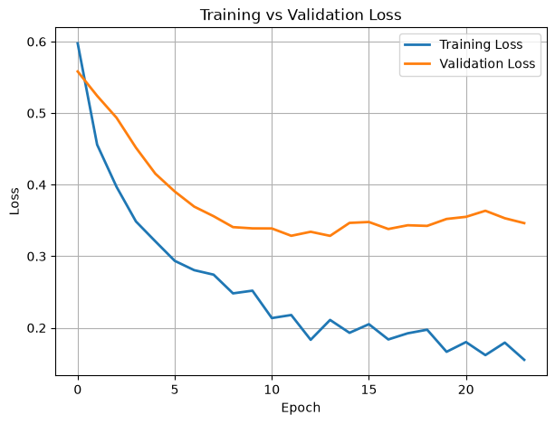

# Final Report

# Deep Learning-Based Athlete Injury Risk Analyzer

**Student:** SHUGAVANTH R (727824TUAM046)
**Course:** 23ADC04 — Deep Learning | III Year CSE (AIML)
**Institution:** Sri Krishna College of Technology, Coimbatore, Tamil Nadu

---

## Abstract

This project develops a decision-support prototype that estimates the probability of elevated injury risk from 15 athlete demographic, anthropometric, training, recovery, and self-reported variables. The primary predictive model is a fully connected deep neural network (multi-layer perceptron, MLP) with 128–64–32–16 hidden units, rectified linear unit (ReLU) activations, batch normalization, and dropout regularization. A separate symmetric autoencoder is also trained to learn a 16-dimensional unsupervised representation of the same standardized feature set. The supervised MLP was trained on 800 records and evaluated once on a stratified, held-out test set of 200 records. At a fixed probability threshold of 0.50, it obtained accuracy 0.8850, precision 0.6923, recall 0.7105, F1-score 0.7013, and ROC-AUC 0.9108; it exceeded the recorded logistic-regression baseline on every reported metric. The application exposes a probability, a three-band risk label, individualized recommendations, and local SHAP and LIME explanations. These results are promising for a coursework prototype, but they are not clinical validation: the data source, label construction, external generalizability, calibration, and decision thresholds require prospective validation before use in medical or return-to-play decisions.

**Keywords:** athlete injury risk; deep learning; multi-layer perceptron; autoencoder; explainable AI; SHAP; LIME; tabular data

## 1. Introduction

Sports injuries can reduce participation, performance, and long-term health. Injury occurrence is multifactorial: prior injury, training exposure, recovery, anthropometry, sleep, stress, and sport-specific load may interact in non-linear ways [1–6]. This makes a single universal screening rule unrealistic. Machine learning can summarize patterns in routinely collected variables, but a useful system must report uncertainty, avoid causal claims, and remain understandable to coaches and athletes [7–10].

The objective of this project is to build an accessible, reproducible proof of concept for binary injury-risk classification from tabular athlete data. The project has four deliverables: (1) reproducible preprocessing and a train/test split, (2) a regularized MLP classifier, (3) an unsupervised autoencoder module for representation learning, and (4) a Streamlit interface with local explanations and recommendations. The output is a risk estimate, not a diagnosis, a causal explanation, or a replacement for a qualified clinician.

## 2. Dataset and Problem Definition

### 2.1 Dataset profile

The local `Athlete.xlsx` dataset contains 1,000 rows and 16 columns: 15 predictors and the binary target `Injury_Risk`. The class counts are 809 low-risk records (0) and 191 high-risk records (1). No missing values were recorded in the report dataset.

| Feature group | Variables used |
|---|---|
| Demographic / anthropometric | Age, Gender, Height_cm, Weight_kg, BMI |
| Training exposure | Training_Frequency, Training_Duration, Warmup_Time, Training_Intensity |
| Recovery / condition | Sleep_Hours, Flexibility_Score, Muscle_Asymmetry, Recovery_Time, Stress_Level |
| History | Injury_History |
| Target | Injury_Risk (0 = low risk, 1 = high risk) |

The dataset has moderate class imbalance (19.1% high risk). Therefore accuracy is reported alongside precision, recall, F1-score, ROC-AUC, and a confusion matrix. Because the dataset documentation does not establish whether labels are prospective injuries, expert annotations, or a constructed rule, the model should be interpreted as learning the dataset label—not as proving future injury causation.

### 2.2 Experimental split

The preprocessor performs an 80/20 stratified split with `random_state=42`, yielding 800 development records and 200 held-out test records. The test set contains 162 low-risk and 38 high-risk records. A further 20% of the 800 development records is used by Keras as the validation split during training (approximately 640 fitting and 160 validation records). Scaling parameters are fit on training data and persisted with the other preprocessing artifacts for inference consistency.

## 3. Data Preparation

1. **Cleaning and typing:** the Excel file is loaded with pandas/openpyxl; duplicates can be removed and numeric/categorical missing values are handled by mean/mode imputation in the preprocessing module.
2. **Categorical encoding:** `Gender` and `Injury_History` are transformed with label encoders.
3. **Stratified partitioning:** `train_test_split(..., stratify=y, random_state=42)` preserves the minority-class proportion in the test set.
4. **Standardization:** `StandardScaler` transforms every input to approximately zero mean and unit variance using training-set statistics. This is particularly important for gradient-based neural-network optimization because inputs such as height, sleep, and flexibility have different scales [11].
5. **Deployment artifacts:** the scaler, encoders, feature names, test/train arrays, and a background sample for explanation are saved in `models/`. The deployed app applies the same transformations before prediction.

No resampling, SMOTE, class weighting, feature selection, or threshold optimization was used in the recorded run. This avoids changing the apparent class prevalence, but may leave recall for the minority class below a domain-acceptable level. Such choices should be evaluated only inside a cross-validation pipeline to prevent leakage [12,13].

## 4. Deep-Learning Methods

### 4.1 Primary model: regularized MLP classifier

The supervised model is implemented in `model.py` as a Keras `Sequential` network. For a standardized input vector $x \in \mathbb{R}^{15}$, each dense layer computes $h = f(Wx+b)$. Hidden layers use ReLU, $f(z)=\max(0,z)$, to introduce non-linearity and support efficient gradient propagation [14]. The final sigmoid unit produces $\hat p = \sigma(z)=1/(1+e^{-z})$, interpreted as the model-estimated probability of the positive (`Injury_Risk=1`) class.

| Block | Operation | Output shape | Parameters | Purpose |
|---|---|---:|---:|---|
| Input | 15 standardized features | 15 | 0 | Receives tabular athlete profile |
| 1 | Dense(128, ReLU) → BatchNorm → Dropout(0.30) | 128 | 2,560 | Learns broad non-linear feature combinations; regularized |
| 2 | Dense(64, ReLU) → BatchNorm → Dropout(0.30) | 64 | 8,512 | Learns higher-order interactions; regularized |
| 3 | Dense(32, ReLU) | 32 | 2,080 | Compresses learned representation |
| 4 | Dense(16, ReLU) | 16 | 528 | Compact discriminative representation |
| Output | Dense(1, sigmoid) | 1 | 17 | Outputs $P(\mathrm{high\ risk})$ |
| **Total** |  |  | **13,697** | **13,313 trainable; 384 non-trainable BatchNorm statistics** |

Batch normalization normalizes intermediate activations within a mini-batch and learns a scale and shift, helping stabilize optimization [15]. Dropout randomly masks 30% of units in the first two hidden blocks during training, reducing co-adaptation and overfitting risk [16]. At inference, dropout is disabled and the full network is used. These methods regularize the model; they do not guarantee that its probability estimates are calibrated [17].

### 4.2 Optimization, loss, and stopping

The model is optimized with Adam (initial learning rate $10^{-3}$) [18] and binary cross-entropy:

$$
\mathcal{L}_{BCE}=-\frac{1}{N}\sum_{i=1}^{N}\left[y_i\log(\hat p_i)+(1-y_i)\log(1-\hat p_i)\right].
$$

The recorded training configuration is shown below.

| Setting | Value |
|---|---|
| Optimizer | Adam, learning rate 0.001 |
| Objective | Binary cross-entropy |
| Batch size | 32 |
| Maximum epochs | 100 |
| Actual recorded epochs | 24 |
| Metrics during fit | Accuracy, precision, recall, ROC-AUC |
| Validation split | 20% of development set |
| Early stopping | Monitor `val_loss`, patience 10, restore best weights |
| Learning-rate schedule | ReduceLROnPlateau on `val_loss`, factor 0.5, patience 5, minimum $10^{-6}$ |
| Checkpoint | Best `val_accuracy` saved as `models/best_model.keras` |

Early stopping protects against continuing once validation loss no longer improves, while restoring the best observed validation-loss weights [19]. The training checkpoint is monitored by validation accuracy, whereas early stopping and learning-rate reduction monitor validation loss; this difference should be harmonized in a future protocol. A fixed random seed for TensorFlow and repeated/cross-validated evaluation would also improve reproducibility and reduce uncertainty from one split [12,20].

### 4.3 Autoencoder: unsupervised representation learning

`autoencoder.py` implements a second deep-learning technique, a symmetric feed-forward autoencoder. It takes the same 15 standardized features and reconstructs them through the architecture:

`15 → Dense(64, ReLU) → Dense(32, ReLU) → Dense(16, ReLU) → Dense(32, ReLU) → Dense(64, ReLU) → Dense(15, linear)`.

The encoder maps inputs to a 16-dimensional latent representation; the decoder reconstructs the 15 input variables. It has 7,263 parameters in total (3,632 in the encoder). It is trained with Adam (0.001) and mean-squared reconstruction error,

$$
\mathcal{L}_{MSE}=\frac{1}{N}\sum_{i=1}^{N}\lVert x_i-\tilde{x}_i\rVert_2^2.
$$

Autoencoders can capture correlated structure and offer compact features for later analysis or anomaly-oriented work [21–23]. In this repository, the autoencoder is a separately trained Module 2 artifact; its latent vectors are **not** fed into the reported MLP classifier. Consequently, its reconstruction-loss curve demonstrates representation learning but must not be presented as improving the classifier’s test metrics without an explicit ablation experiment.

### 4.4 Explainability and application layer

The Streamlit application (`app.py`) reports the predicted positive-class probability and applies the app’s three-band risk-label logic. It also uses:

* **SHAP KernelExplainer:** a model-agnostic approximation to Shapley-value feature attributions, using up to 100 standardized training examples as the background distribution [24,25]. Positive/negative contributions explain the prediction relative to that background; they are not causal effects.
* **LIME TabularExplainer:** generates perturbed points around one athlete profile and fits a sparse local surrogate explanation [26]. The implementation supplies two-column probabilities `[P(low), P(high)]`, as required for classification.
* **Recommendation mapping:** deterministic app rules turn the risk label and input profile into general training/recovery suggestions. These recommendations are not treatment prescriptions.

Local explanations may vary with the background set, sampling, correlated features, and random perturbations. They should be presented as aids to review rather than proof that a factor caused an injury [27–29].

## 5. Results and Outputs

### 5.1 Training output

The persisted training history contains 24 epochs. At the final recorded epoch, training accuracy was 0.9234, training loss 0.1552, validation accuracy 0.8688, and validation loss 0.3463. The best recorded validation accuracy was 0.8875; the minimum recorded validation loss was 0.3285. The difference between final training and validation performance is consistent with some generalization gap, so the use of dropout, batch normalization, and early stopping is appropriate. It does not replace external validation.

### 5.2 Held-out test output

All numbers below are from `results/baseline_comparison.csv` and the saved 200-record test split. Predictions are converted to class labels using the default threshold $\hat p\ge0.50$.

| Metric | MLP / DNN | Logistic regression baseline | Absolute change |
|---|---:|---:|---:|
| Accuracy | 0.8850 | 0.8600 | +0.0250 |
| Precision | 0.6923 | 0.6250 | +0.0673 |
| Recall | 0.7105 | 0.6579 | +0.0526 |
| F1-score | 0.7013 | 0.6410 | +0.0603 |
| ROC-AUC | 0.9108 | 0.8970 | +0.0138 |

The MLP improves the recorded baseline on all five metrics. In particular, F1-score improves by 0.0603 and recall by 0.0526, which are more informative than accuracy alone for this imbalanced dataset. However, a single test split cannot establish statistical superiority; confidence intervals, repeated stratified cross-validation, calibration analysis, and a prospective external cohort are needed [12,13,30].

### 5.3 Confusion matrix and output interpretation

The test-set confusion matrix reconstructed from the saved metrics is:

| Actual \ Predicted | Low risk | High risk |
|---|---:|---:|
| Low risk (n = 162) | 150 (true negative) | 12 (false positive) |
| High risk (n = 38) | 11 (false negative) | 27 (true positive) |

Thus the classifier identified 27 of 38 positive-class records and missed 11. Whether this error balance is acceptable depends on the intended intervention and the harms of false reassurance versus unnecessary follow-up. The 0.50 threshold is a software default, not a validated clinical operating point; threshold selection should be made with domain stakeholders and decision-analytic evaluation [31,32].

### 5.4 Generated outputs

The repository retains the following visual and model outputs:

| Output | Meaning |
|---|---|
| `results/accuracy_curve.png` | Training and validation accuracy by epoch |
| `results/loss_curve.png` | Training and validation binary cross-entropy by epoch |
| `results/confusion_matrix.png` | Class errors at threshold 0.50 |
| `results/roc_curve.png` | True-positive versus false-positive rate; DNN ROC-AUC = 0.9108 |
| `results/precision_recall_curve.png` | Precision–recall trade-off, useful for minority-class assessment |
| `results/baseline_comparison_chart.png` | DNN versus logistic-regression metric comparison |
| `results/autoencoder_loss_curve.png` | Autoencoder reconstruction-loss learning curve |
| `models/best_model.keras` | Saved trained MLP used by evaluation/app |

## 6. Discussion, Limitations, and Ethics

The results indicate that a small regularized MLP can represent non-linear patterns in this tabular dataset better than the recorded linear baseline. The ROC-AUC is high, but performance should not be inflated into a clinical claim. Injury prediction studies are vulnerable to outcome-definition differences, small samples, data leakage, shifting training practices, and limited external validity [3–7,33].

Important limitations are:

1. **Dataset provenance and labels:** the report does not establish a prospective injury definition, follow-up window, sport, or labelling protocol.
2. **Small, single dataset:** 1,000 records are limited for a 13,313-trainable-parameter network; results from one split have sampling uncertainty.
3. **No external validation or calibration study:** discrimination (ROC-AUC) does not prove probability reliability. Calibration plots, Brier score, and recalibration should be assessed [17,34].
4. **Imbalance and fixed threshold:** minority-class recall is 0.7105 and 11 positive records are missed. Class weights, focal loss, resampling, and threshold selection require validation without leakage [13,35].
5. **Feature scope:** self-report measures and static features omit sport-specific exposure, biomechanics, prior injury severity, longitudinal workload, and clinician assessment. Correlation does not establish causation.
6. **Fairness and privacy:** results should be stratified by relevant groups only when sample sizes support it; health-related data need consent, access control, minimization, and clear governance [36].

Future work should collect a prospectively labelled, multi-sport longitudinal cohort; pre-register outcome and evaluation definitions; compare MLPs with penalized logistic regression, tree ensembles, and temporal models; use nested cross-validation; assess calibration and decision curves; and conduct clinician-in-the-loop usability testing. For longitudinal training-load sequences, recurrent, temporal-convolutional, or transformer models could be evaluated only after sufficient, time-indexed data are available [37–39].

## 7. Conclusion

This project delivers a reproducible deep-learning prototype for tabular athlete injury-risk classification. Its primary 13,697-parameter MLP combines ReLU dense layers, batch normalization, dropout, Adam optimization, adaptive learning-rate reduction, and early stopping. A separate 7,263-parameter autoencoder demonstrates unsupervised feature reconstruction. On the saved held-out split, the MLP achieved 0.8850 accuracy, 0.7013 F1-score, and 0.9108 ROC-AUC, outperforming the recorded logistic-regression baseline. SHAP, LIME, and a Streamlit interface make the output easier to inspect, but neither explanations nor predictive metrics turn the system into a medical device. Prospective external validation, calibration, subgroup analysis, and clinician oversight are required before real-world decision use.

## 8. Module Mapping

| Module | Technique | Repository implementation |
|---|---|---|
| Module 1 | Supervised MLP classification | `model.py`, `train.py`, `evaluate.py` |
| Module 2 | Symmetric feature-reconstruction autoencoder | `autoencoder.py`, `train_autoencoder.py` |
| Module 3 | Applied XAI and deployment | `explainability.py`, `app.py`, `predict_recommendation.py` |

## 9. References

[1] Bahr, R., & Krosshaug, T. (2005). Understanding injury mechanisms: A key component of preventing injuries in sport. *British Journal of Sports Medicine, 39*(6), 324–329. https://doi.org/10.1136/bjsm.2005.018341

[2] Meeuwisse, W. H. (1994). Assessing causation in sport injury: A multifactorial model. *Clinical Journal of Sport Medicine, 4*(3), 166–170.

[3] Bittencourt, N. F. N., Meeuwisse, W. H., Mendonça, L. D., Nettel-Aguirre, A., Ocarino, J. M., & Fonseca, S. T. (2016). Complex systems approach for sports injuries: Moving from risk factor identification to injury pattern recognition. *British Journal of Sports Medicine, 50*(21), 1309–1314. https://doi.org/10.1136/bjsports-2015-095850

[4] Windt, J., & Gabbett, T. J. (2017). Is it all for naught? What does mathematical coupling mean for acute:chronic workload ratios? *British Journal of Sports Medicine, 53*(16), 988–990. https://doi.org/10.1136/bjsports-2017-098925

[5] Impellizzeri, F. M., Marcora, S. M., & Coutts, A. J. (2019). Internal and external training load: 15 years on. *International Journal of Sports Physiology and Performance, 14*(2), 270–273. https://doi.org/10.1123/ijspp.2018-0935

[6] Soligard, T., Schwellnus, M., Alonso, J.-M., et al. (2016). How much is too much? (Part 1) International Olympic Committee consensus statement on load in sport and risk of injury. *British Journal of Sports Medicine, 50*(17), 1030–1041. https://doi.org/10.1136/bjsports-2016-096581

[7] van Mechelen, W., Hlobil, H., & Kemper, H. C. G. (1992). Incidence, severity, aetiology and prevention of sports injuries: A review of concepts. *Sports Medicine, 14*(2), 82–99. https://doi.org/10.2165/00007256-199214020-00002

[8] Claudino, J. G., Capanema, D. de O., de Souza, T. V., Serrão, J. C., Machado Pereira, A. C., & Nassis, G. P. (2019). Current approaches to the use of artificial intelligence for injury risk assessment and performance prediction in team sports: A systematic review. *Sports Medicine - Open, 5*, 28. https://doi.org/10.1186/s40798-019-0202-3

[9] Van Eetvelde, H., Mendonça, L. D., Ley, C., Seil, R., & Tischer, T. (2021). Machine learning methods in sport injury prediction and prevention: A systematic review. *Journal of Experimental Orthopaedics, 8*, 27. https://doi.org/10.1186/s40634-021-00346-x

[10] Bullock, G. S., et al. (2021). Just how confident can we be in predicting sports injuries? A systematic review of the methodological quality of prediction models. *Sports Medicine, 51*, 2449–2464.

[11] Sola, J., & Sevilla, J. (1997). Importance of input data normalization for the application of neural networks to complex industrial problems. *IEEE Transactions on Nuclear Science, 44*(3), 1464–1468. https://doi.org/10.1109/23.589532

[12] Varma, S., & Simon, R. (2006). Bias in error estimation when using cross-validation for model selection. *BMC Bioinformatics, 7*, 91. https://doi.org/10.1186/1471-2105-7-91

[13] Fernández, A., Garcia, S., Galar, M., Prati, R. C., Krawczyk, B., & Herrera, F. (2018). *Learning from Imbalanced Data Sets.* Springer. https://doi.org/10.1007/978-3-319-98074-4

[14] Nair, V., & Hinton, G. E. (2010). Rectified linear units improve restricted Boltzmann machines. In *Proceedings of ICML* (pp. 807–814).

[15] Ioffe, S., & Szegedy, C. (2015). Batch normalization: Accelerating deep network training by reducing internal covariate shift. In *Proceedings of ICML* (pp. 448–456).

[16] Srivastava, N., Hinton, G., Krizhevsky, A., Sutskever, I., & Salakhutdinov, R. (2014). Dropout: A simple way to prevent neural networks from overfitting. *Journal of Machine Learning Research, 15*, 1929–1958.

[17] Guo, C., Pleiss, G., Sun, Y., & Weinberger, K. Q. (2017). On calibration of modern neural networks. In *Proceedings of ICML* (pp. 1321–1330).

[18] Kingma, D. P., & Ba, J. (2015). Adam: A method for stochastic optimization. In *International Conference on Learning Representations.* arXiv:1412.6980.

[19] Prechelt, L. (1998). Early stopping—but when? In G. Orr & K.-R. Müller (Eds.), *Neural Networks: Tricks of the Trade* (pp. 55–69). Springer. https://doi.org/10.1007/3-540-49430-8_3

[20] Nadeau, C., & Bengio, Y. (2003). Inference for the generalization error. *Machine Learning, 52*, 239–281. https://doi.org/10.1023/A:1024068626366

[21] Hinton, G. E., & Salakhutdinov, R. R. (2006). Reducing the dimensionality of data with neural networks. *Science, 313*(5786), 504–507. https://doi.org/10.1126/science.1127647

[22] Vincent, P., Larochelle, H., Bengio, Y., & Manzagol, P.-A. (2008). Extracting and composing robust features with denoising autoencoders. In *Proceedings of ICML* (pp. 1096–1103). https://doi.org/10.1145/1390156.1390294

[23] Bank, D., Koenigstein, N., & Giryes, R. (2021). Autoencoders. In *Machine Learning for Data Science Handbook* (pp. 353–374). Springer. https://doi.org/10.1007/978-3-030-73981-6_15

[24] Lundberg, S. M., & Lee, S.-I. (2017). A unified approach to interpreting model predictions. In *Advances in Neural Information Processing Systems, 30.*

[25] Lundberg, S. M., et al. (2020). From local explanations to global understanding with explainable AI for trees. *Nature Machine Intelligence, 2*, 56–67. https://doi.org/10.1038/s42256-019-0138-9

[26] Ribeiro, M. T., Singh, S., & Guestrin, C. (2016). “Why should I trust you?” Explaining the predictions of any classifier. In *Proceedings of KDD* (pp. 1135–1144). https://doi.org/10.1145/2939672.2939778

[27] Molnar, C. (2022). *Interpretable Machine Learning* (2nd ed.). https://christophm.github.io/interpretable-ml-book/

[28] Adebayo, J., Gilmer, J., Muelly, M., Goodfellow, I., Hardt, M., & Kim, B. (2018). Sanity checks for saliency maps. In *Advances in Neural Information Processing Systems, 31.*

[29] Slack, D., Hilgard, S., Jia, E., Singh, S., & Lakkaraju, H. (2020). Fooling LIME and SHAP: Adversarial attacks on post hoc explanation methods. In *Proceedings of AIES* (pp. 180–186). https://doi.org/10.1145/3375627.3375830

[30] Demšar, J. (2006). Statistical comparisons of classifiers over multiple data sets. *Journal of Machine Learning Research, 7*, 1–30.

[31] Vickers, A. J., & Elkin, E. B. (2006). Decision curve analysis: A novel method for evaluating prediction models. *Medical Decision Making, 26*(6), 565–574. https://doi.org/10.1177/0272989X06295361

[32] Steyerberg, E. W. (2019). *Clinical Prediction Models* (2nd ed.). Springer. https://doi.org/10.1007/978-3-030-16399-0

[33] Collins, G. S., Reitsma, J. B., Altman, D. G., & Moons, K. G. M. (2015). Transparent Reporting of a multivariable prediction model for Individual Prognosis Or Diagnosis (TRIPOD). *Annals of Internal Medicine, 162*(1), 55–63. https://doi.org/10.7326/M14-0697

[34] Brier, G. W. (1950). Verification of forecasts expressed in terms of probability. *Monthly Weather Review, 78*(1), 1–3. https://doi.org/10.1175/1520-0493(1950)078<0001:VOFEIT>2.0.CO;2

[35] Lin, T.-Y., Goyal, P., Girshick, R., He, K., & Dollár, P. (2017). Focal loss for dense object detection. In *Proceedings of ICCV* (pp. 2980–2988). https://doi.org/10.1109/ICCV.2017.324

[36] World Health Organization. (2021). *Ethics and governance of artificial intelligence for health: WHO guidance.* https://www.who.int/publications/i/item/9789240029200

[37] Hochreiter, S., & Schmidhuber, J. (1997). Long short-term memory. *Neural Computation, 9*(8), 1735–1780. https://doi.org/10.1162/neco.1997.9.8.1735

[38] Bai, S., Kolter, J. Z., & Koltun, V. (2018). An empirical evaluation of generic convolutional and recurrent networks for sequence modeling. arXiv:1803.01271.

[39] Vaswani, A., et al. (2017). Attention is all you need. In *Advances in Neural Information Processing Systems, 30.*

---

*Prepared from the repository’s saved code, preprocessing artifacts, training history, and evaluation outputs. Last updated: 24 July 2026.*
